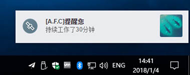

## Electron Notifications Lite
关于Electron的notification，先总结我的经验。Mac下直接用electron的notification module就可以。Win下的notification如果想要用win原生的，会有一些问题。Win7和win8/8.1/10在用户体验和内容上差别很大，前者为气泡，后者为Metro风格的。electron自己的notification现在这个版本(18-01-01)在win下问题很多。另外，electron-windows-notifcation这个在8/8.1/10上表现很好，但是不支持7，但7很用户量更大。

所以还是用这个electron-notifications，它是直接用browserwindow模拟的notification，原本的UI比较丑、Bug也很多，并且细节上闪烁也比较严重，但它会是比较稳定的（因为其原理）。原来的项目bug提了很久也不修，似乎作者并不想维护了。而A.F.C App正好有这个需求，因而在原fork基础上进行了一些工作。

本分支附加了-lite作为名字，您可安装：

```
npm install --save electron-notifications-lite 
```




当前状态说明：

- 不再支持所谓的vertical 模式，不再支持按钮。
- 当Notification被点击时，它会向主线程发```notification-lite-click```的消息。
- option中增加一个adicon字段，能够额外在右侧显示一个ICON。


其他说明见原fork稳定：

-------


A node module for sending notifications in electron applications.


## Quick Usage

~~~ javascript
const notifier = require('electron-notifications')

// Just title
notifier.notify('Calendar')

// Full Options
notifier.notify('Calendar', {
  message: 'Event begins in 10 minutes',
  icon: 'http://cl.ly/J49B/3951818241085781941.png',
  buttons: ['Dismiss', 'Snooze'],
})
~~~

## Installation

~~~
npm install --save electron-notifications
~~~

## Playbook

If you'd like to see this in action you can run the playbook and try out live
examples and edit the code in place.

~~~
git clone git@github.com:blainesch/electron-notifications.git
npm run playbook
~~~

## Introduction

When you create a new notification, your notification is queued, since we only
display one at a time. Each notification is a [BrowserWindow](browserwindow)
instance, so it's completely cross platform.

## Options

All options are optional.

* `message`: A message to display under the title.
* `icon`: The absolute URL of a icon displayed to the left of the text.
* `buttons`: One or two buttons to display on the right of the notification.
* `vertical`: Boolean (default: false) that specifies that the buttons should be stacked vertically.
* `duration`: Integer duration in milliseconds (default: 4000) to show the notification.
* `flat`: Boolean (default: false) that specifies to use a flat button style notification.

## Events

In addition to the [events provided by electron](events) you also have access to
the following 3 additional events.


### Clicked

When the notification was clicked, but not dragged. This usually does the
default action, or closes the notification.

~~~ javascript
const notification = notifier.notify('Calendar')

notification.on('clicked', () => {
  notification.close()
})
~~~

### Swiped Right

When the notification has been swiped to the right. This usually indicates that
the user wants to dismiss the notification.

~~~ javascript
const notification = notifier.notify('Calendar')

notification.on('swipedRight', () => {
  notification.close()
})
~~~

### Button Clicked

When any one of the buttons are clicked, it'll trigger a `buttonClicked` event,
and pass the text, button index and options to the handler.

~~~ javascript
const notification = notifier.notify('Calendar', {
  buttons: ['Dismiss', 'Snooze'],
  url: "http://google.com"
})

notification.on('buttonClicked', (text, buttonIndex, options) => {
  if (text === 'Snooze') {
    // Snooze!
  } else if(buttonIndex === 1) {
    //open options.url
  }
  notification.close()
})
~~~

[events]: https://github.com/electron/electron/blob/master/docs/api/browser-window.md#events
[browserwindow]: https://github.com/electron/electron/blob/master/docs/api/browser-window.md
