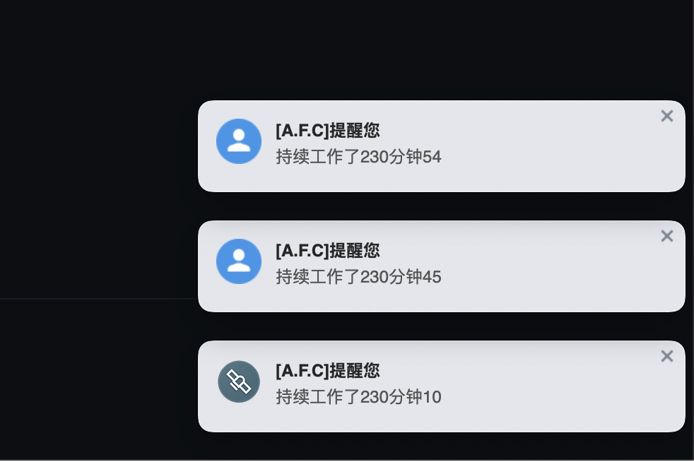

## Electron Notifications
electron 原生Notifications 在window10下，具备一些优点，如在通知展示内容上原生的 Notifications toastXml 提供了完全自定义的设计。但限制也比较明显，比如强制展示至少5秒才会继续展示下一条通知，通知队列由操作系统控制，开发者无法修改队列逻辑。

这个库直接用 browserWindow 模拟的 Notifications，相比原生自定义UI的能力弱很多，但通知展示时长、展示个数等可以由开发者决定，在通知的使用场景下提供了更好的**即时**展示能力。这个项目在原fork基础上做了较大修改工作，旨在开发一个仿windows风格但能够突破这些限制的通知库。

## 安装
```
npm install --save electron-notifications-win 
```




## 和原fork的功能区别

- 不再支持vertical、flat 模式，不再支持按钮 buttons。
- 不支持swipedRight、buttonClicked事件，clicked事件改为click
- 新增关闭按钮，支持close事件
- 新增通知展示个数上限，可支持修改，通知展示个数达到上限后，销毁最早的一条通知
- 新增通知样式width、height、marginRight、spaceHeight，可支持修改

## 版本更新

1.0.0
- 见和原fork的功能区别

## 快速使用

在主进程中使用
``` javascript
const notifier = require('electron-notifications-win');

// （可选）设置全局配置
notifier.config({
  duration: 5000,
  spaceHeight: 20,
  icon: 'icon.png',
});

notifier.notify({
  title: 'from main process',
  body: '你好1',
})
// 监听close事件
.on('close', (id) => {
  console.log('close', id);
});

notifier.notify({
  title: 'from main process',
  body: '你好2',
})
// 监听click事件
.on('click', (id) => {
  console.log('click', id);
});
```
在渲染进程中使用
``` javascript
// 使用自己定义的ipcRenderer向主进程发送 notifier.notify 消息
const ipcRenderer = window.electron.ipcRenderer;
const random = Math.round(Math.random() * 100);
ipcRenderer.send('notifier.notify', {
  title: '[A.F.C]提醒您',
  body: '持续工作了230分钟' + random,
  icon: 'https://nos.netease.com/ysf/b05c70fca471eabbdccfed6f73e424e7.png',
  duration: 3000
});
```

## Demo

快速查看Demo示例

```
git clone git@github.com:NSFI/electron-notifications-win.git
npm run playbook
```

## 全局配置

All options are optional.

* `limit`: 至多展示的通知个数
* `width`: 通知本体的宽度
* `height`: 通知本体的高度
* `marginRight`: 通知外框的右边外边距
* `spaceHeight`: 通知之间的上下间距
* `icon`: 左边展示的icon
* `duration`: 通知展示时长，单位：毫秒
  
```javascript
// （可选）设置全局配置
notifier.config({
  duration: 5000,
  spaceHeight: 20,
  icon: 'icon.png',
});
```
## 实例配置

All options are optional.

* `title`: 通知的标题
* `body`: 通知的内容
* `icon`: 左边展示的icon，未设置时使用全局配置
* `duration`: 通知展示时长，单位：毫秒，未设置时使用全局配置，全局配置未设置默认为4秒

## 事件


### click

通知被点击事件

``` javascript
const notification = notifier.notify({
  title: 'Calendar',
});

notification.on('click', (id) => {
  // do something
});
```

### close

通知被关闭事件

``` javascript
const notification = notifier.notify({
  title: 'Calendar',
});

notification.on('close', (id) => {
  // do something
});
```